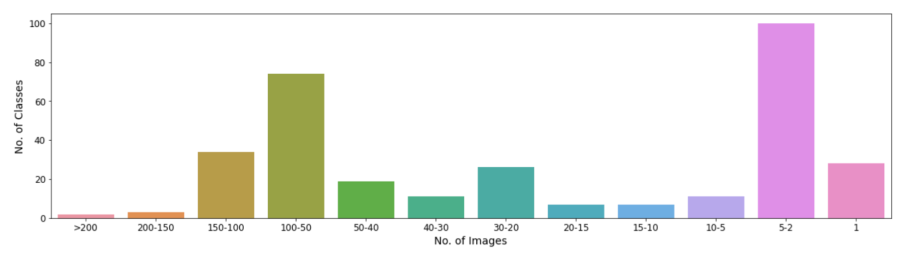
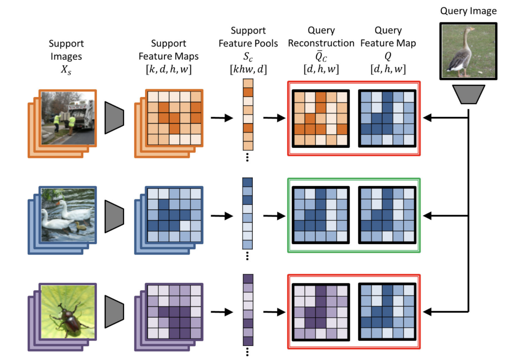

# Fine_Grained_Classificaiton

Fine-grained categorization, as a sub-field of object recognition, aims to distinguish subordinate categories within entry level categories. Examples include recognizing species of birds such as “northern cardinal” or  “indigo bunting”; flowers such as “tulip” or “cherry blossom”. Fine-grained categorization often requires efforts from different aspects compared with generic object recognition. 

Here in this project, I applied few short learning algorithm for classifing different retail products placed on shelf.

## Exploratory Data Analysis
The dataset provided is analyzed on the distribution of images among the classes. There were 258 classes and the images on each class are distributed as shown below

From the chart, it is found that the number of images ranges from 1 to 256. Having skewed distribution in the dataset, few-shot learning is an optimal solution to this problem. Hence the below problem statement.

“To classify the types of nuts and snacks from the grocery products with few-shot learning algorithm”
Also, a data-cleaning process is performed to deal with outliers in the dataset. The mean and variance of the images are calculated to know the distribution among them in the dataset. The outliers are found and visualized as a black image and have been removed for the training.

## Classification model

The classification algorithm is performed with the below paper and the baseline model trained is ResNet 12.

### Few-Shot Classification with Feature Map Reconstruction Networks
In this paper, a few-shot classification is formulated as a reconstruction problem. The basic principle is to reconstruct a feature map for any given image and compare it with the support image’s feature map which has been already trained on the model. If the comparison metric ( the negative distance between the feature map) is high, then the query and support are in the same class. The training process is performed on 2-shot learning.
### Data preparation to perform 2-shot learning
For the training and validation of the model, each class must contain a minimum of 5 such that 3 images are used for training (in which one will be a query image and two will be in support images). The remaining 2 images in the class (in which one will be a query image and another will be in support image) will be used for validating the model. This way of training the model makes the algorithm robust to perform equally on all of the classes in turn solves the imbalance in our dataset.

## Model architecture

In the above images, k is denoted for k-shot learning. The distance calculated between Qc and Q with softmax acts as the classification layer in the architecture. Here, the feature maps of query and support are extracted from the Resnet-12 which is our baseline model.

## Training
Here, the 2-shot learning is implemented as above wherein a total of 194 classes from 258 classes are used for training (as they had a minimum of 5 images). In total, 582 images are used for training and 388 images for validating the model. The remaining classes and images are used in testing the model. The training parameters are as follows
 - Epochs - 200
 - Optimizer - Stochastic gradient descent with 0.1 learning rate
 - Number of ways- 10 (number of classes needed to be included for an iteration in the epoch)
 - Weight decay - 5e-4
 - Metric for validation - Accuracy. 
The obtained best validation accuracy is 69.74%.

## Testing and Performance analysis
The remaining classes and images are used for testing where a maximum of 20 samples on each class is taken. For each query/test image, the support images are the trained classes. As we have used only 194 classes in the training, the remaining in the test are considered as new classes. This can be defined based on the distance obtained from the trained model.
### Example testing:
For n test samples as query images are compared with 194 support images and the distance vector of size (nx194) is obtained from the model. The arg maximum obtained for every query image index is the class that the image belongs to. To know whether the query image belongs to the existing classes or not, a threshold can be set on the obtained maximum distance.
### Performance analysis
In total, 3479 images were taken such that 20 samples for all classes that have samples greater than 20 images in the test set and the remaining classes.
 - The overall average weighted accuracy - 69.60% (among 183 classes)
 - The average weighted accuracy for less than 20 samples classes - 81.13% (among 26 classes)

Here, the accuracy shown is for 194 classes in support images. The number of images used for training in all classes is 3 and so the class weights for all classes remain the same, due to which we have accuracy and weighted accuracy being equal. As the maximum distance gives one among the 194 classes, a threshold T can be set as below. 
𝑖𝑓 𝑚𝑎𝑥(𝑑𝑖𝑠𝑡𝑎𝑛𝑐𝑒) < 𝑇: 𝐶𝑙𝑎𝑠𝑠 ε 194 𝑐𝑙𝑎𝑠𝑠𝑒𝑠
𝑒𝑙𝑠𝑒:  
  𝐶𝑙𝑎𝑠𝑠 = 𝑛𝑒𝑤 𝑐𝑙𝑎𝑠𝑠
The threshold should be set optimally such that the model should express a definite gap between the same class and different class distance values. In our model, the overlap of distance values is present and so the threshold for new class identification is not optimum at this stage.

## Future work:
This algorithm performs equally for all classes irrespective of imbalance present in the class as it learns with 2-shot learning. The change of baseline model and training parameters can improve the model further such that the model can perform well with identifying new classes.
## Reference:
 - Few-Shot Classification with Feature Map Reconstruction Networks -[https://arxiv.org/pdf/2012.01506.pdf]
 - Github reference- https://github.com/Tsingularity/FRN/tree/15d84832ca39a33beb7617cb7a577851e62cb861
